# [Echoes](https://echoes.up.railway.app/)
`Echoes` is a photo journal web application with individual user accounts. The purpose of this application is simple, we have tons of photos in our phones and more often than not most of them do not end up being revisited.
Echoes is an online journal where you get to put words to pictures and reminisce the memory captured in those photos. 

## Development
- The application supports a responsive design and is created using Django framework, Django Rest Framework, HTML, CSS, JavaScript built on top of PostgreSQL database. 
- Application makes use of Django's built in authentication system with a custom User model to enable to user onboarding and authentication process. It also features a fully functional login system with the inclusion of password reset functionality.
- Most of the application is developed using Django's MVT and its ORM tool to manage the application database transactions.
- The main page upon login that features the uploaded content supports an infinite scroll to allow for a smooth scroll through all of the content and provide a better user experience as most users would prefer scrolling through rather than jumping from page to page. To enable this feature, the Django Rest Framework was utilized to create an API to get the user specific content.
- As this is a media heavy application I have used Amazon S3 engine as the media storage service for the uploaded photos
- The static files are stored on the application server

## Deployment
[Echoes](https://echoes.up.railway.app/) is currently deployed on [Railway.app](https://railway.app/)

## UI

- Home Screen
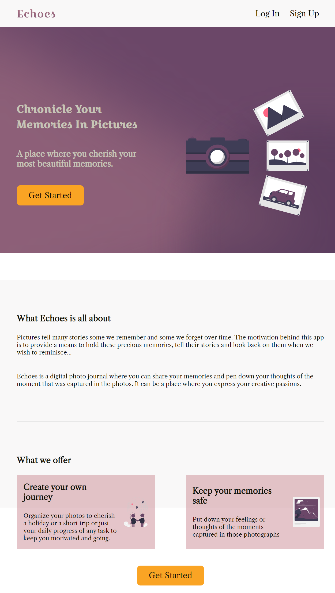
- Registration
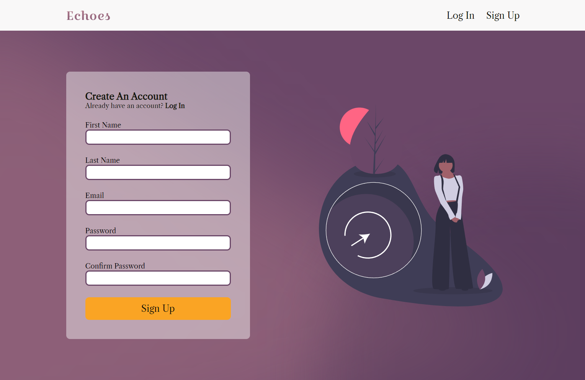
- Login
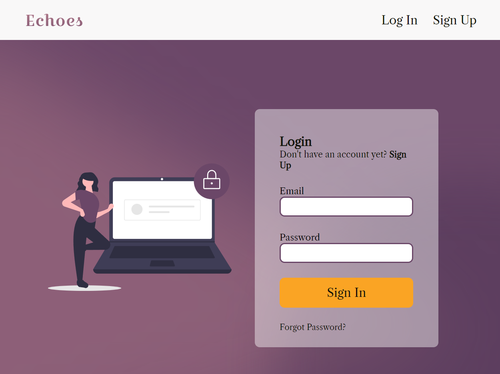
- Main page upon login with no content
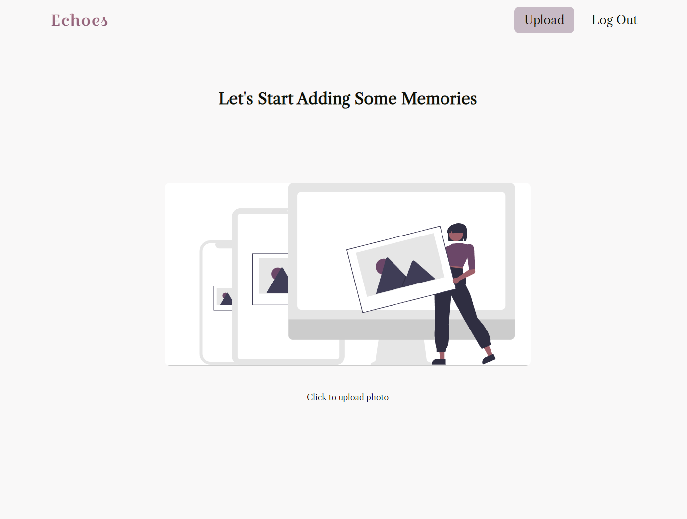
- Main page upon login with content
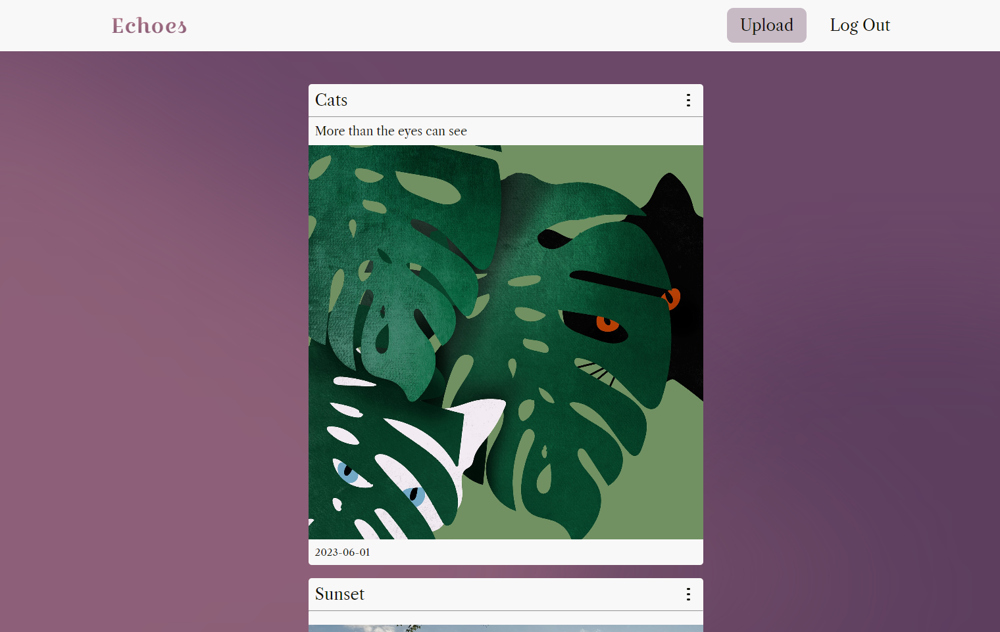
- Upload page
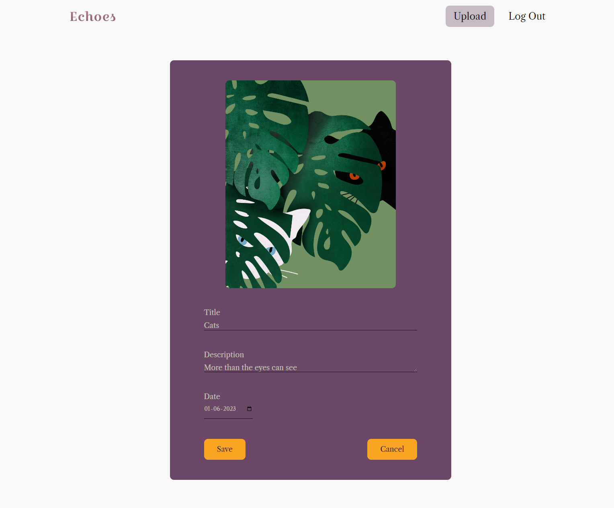
- Delete page
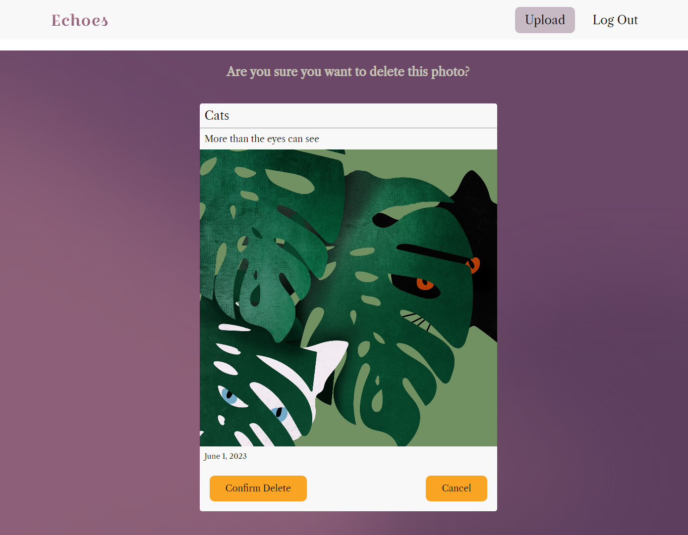
- Edit page

- Reset password 
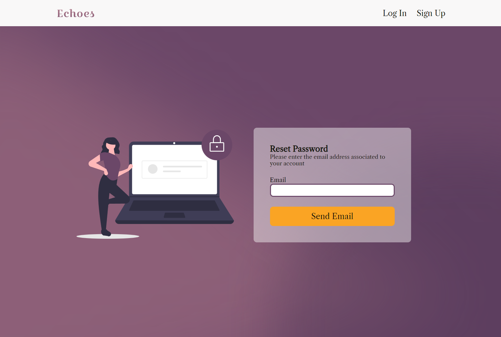 
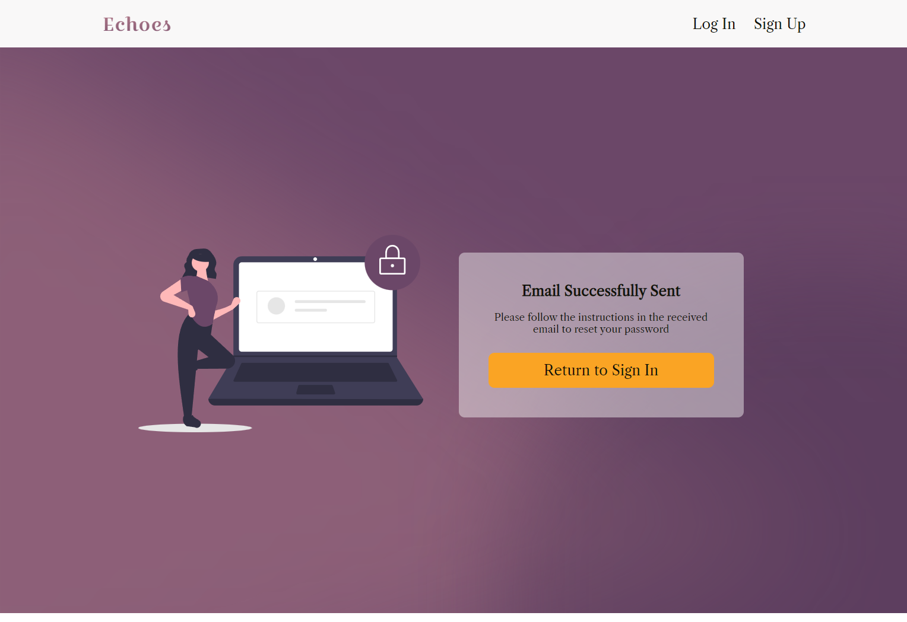 
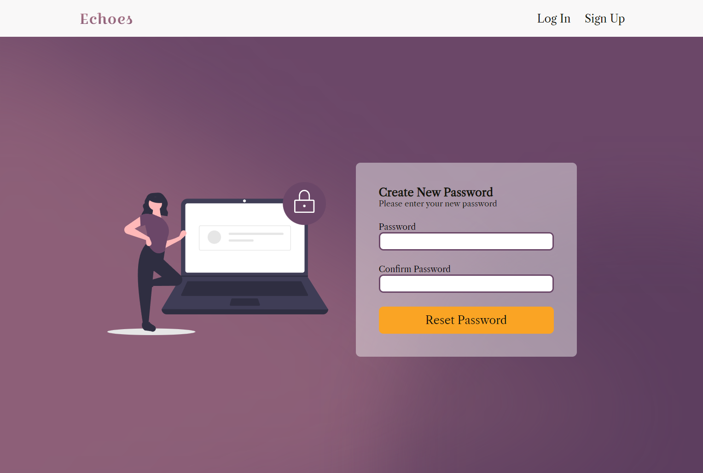
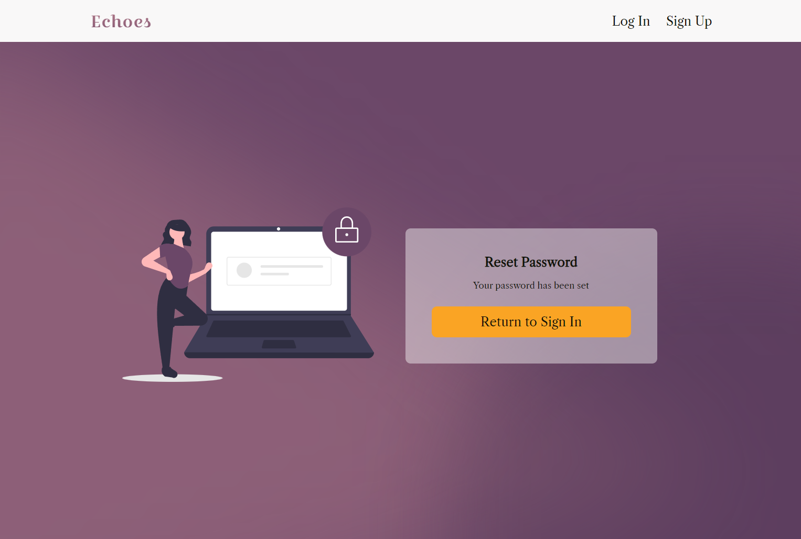

